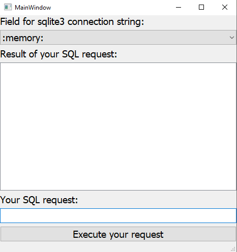
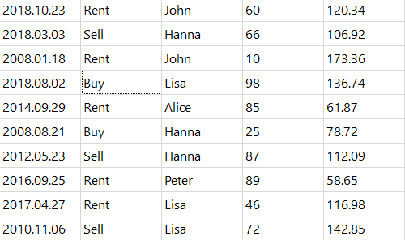
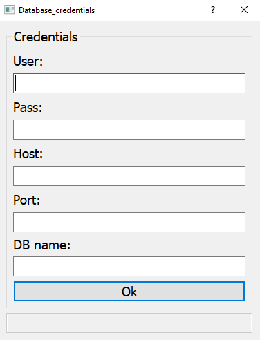

Приложение для выполнения SQL запросов и отображения результата

* Python3, PyQt5, DB-API 2.0 (не QtSql!)

* Поле для ввода sqlite3 connection string (default value - :memory:)

* Поле для ввода запроса

* Кнопочка для запуска

* QTableView для отображения результата

-------------------------------------------------------------------------------------------------------------------------

Решение использует:

    * библиотеку PyQt 5.14 (для gui)
    * PyMySQL (для подключения к соответствующей БД)
    * pandas

Внешний вид приложения:

После запуска приложения, создается таблица stocks в памяти, вида:

production_date | status | salesman | real_value | price

Все поля типа text, кроме предпоследнего (int) и последнего (real).
Простейший SQL - запрос, который сработает ***SELECT * FROM stocks***

Можно изменить БД и подключиться к удаленной MySQL, нажав на ComboBox вверху приложения.
После этого откроется новое окно, где нужно будет ввести данные для аутентификации.

Структура проекта:

* sql_executor.py        ---> главное окно приложения
* db_changer_dialog.py   ---> окно для введения аутентификационных данных
* db_connection.py       ---> класс для взаимодействия с БД
* logger.py              ---> для функционала логгирования